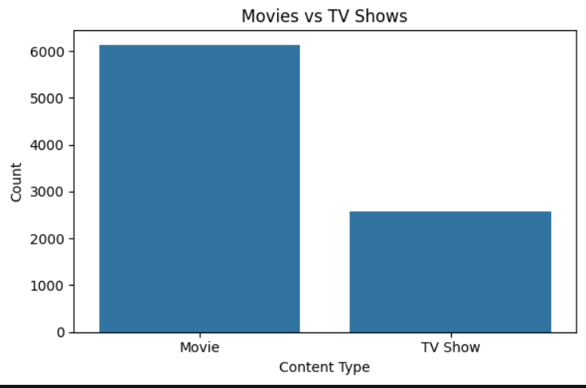

# Netflix Content Analysis

## Objective
The main objective of this project is to analyze Netflix content data and discover meaningful insights about movies and TV shows available on Netflix. This analysis helps understand content distribution, trends, ratings, and country-wise availability using data analysis and visualization techniques.

---

## Technologies Used
- Python
- Pandas
- NumPy
- Matplotlib
- Seaborn
- Jupyter Notebook

---

## Dataset Information
The dataset used in this project is the Netflix Titles Dataset containing information about Netflix movies and TV shows such as:
- Title
- Type (Movie/TV Show)
- Country
- Release Year
- Rating
- Duration
- Genre

Dataset Files:
- netflix_titles.csv
- cleaned_netflix_data.csv

---

## Key Insights
- Movies are more available on Netflix compared to TV Shows.
- The United States has the highest amount of Netflix content.
- TV-MA and TV-14 are the most common content ratings.
- Netflix content releases increased rapidly after 2015.
- Correlation analysis helps identify relationships between numerical features.
- K-Means clustering groups similar content based on selected features.

---

## Screenshots

### 1. Movies vs TV Shows

### 2. Top Countries

### 3. Content Ratings

### 4. Release Trend

### 5. Correlation Heatmap

### 6. KMeans Clustering

---

## Conclusion
This project successfully analyzed Netflix content data using Python and data visualization techniques. The analysis provided insights into content distribution, ratings, release trends, and clustering patterns. This project demonstrates practical skills in data cleaning, exploratory data analysis (EDA), visualization, and machine learning concepts useful for Data Analyst roles.